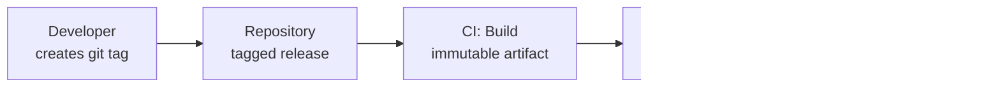
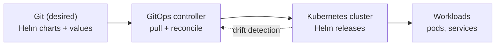

# Richard "Danny" Comeau

Platform and DevOps engineer focused on CI/CD, release automation, and deployment architecture. I design how software gets built, versioned, and shipped, and I automate the operational work around it.

- Senior Consultant, Platform Engineering at [Plante Moran](https://www.plantemoran.com/)
- Co-Founder / CTO at [Wealth Build](https://www.wealthbuild.ai)
- Open to select fractional and advisory engagements (architecture reviews, CI/CD and deployment strategy, technical due diligence). More at [richardcomeau.com](https://richardcomeau.com)

## What I do

On the Platform Engineering team at Plante Moran I own release engineering for internal applications: designing CI/CD pipelines, standardizing how we version and ship software, and building the automation that keeps it reliable.

Selected work:

- Designed a tag-based deployment standard on GitHub Actions that replaced a legacy environment-branch model, cutting average deployment time from over 2 hours to under 30 minutes. Adopted as the organization-wide standard.
- Migrated roughly 60 repositories onto that standard using scripted analysis and a GitHub Copilot fleet rollout: about 120 minutes of review versus an estimated 120 hours of hand work.
- Built PowerShell automation that reduced a recurring reporting task from upwards of 45 hours to under a minute.

### Tag-based deployment standard

Build one immutable artifact, promote that same artifact across environments by git tag. What was tested is exactly what ships.

## Currently building

GitOps for Kubernetes: standing up Helm-based, continuously reconciled deployments and leading the organization's GitOps adoption.

Also in flight: splitting CI and CD ownership so the deploy side runs in its own GitHub org (evaluating Octopus Deploy and Harness), a drift-reconciliation scheduler, and a tag-based release dashboard.

## Selected projects

- richardcomeau.com — my site and content hub: Astro v5, React 19, Tailwind v4, a single Cloudflare Worker, git-based content with Keystatic. Shipped v1.0.0.
- Market Pricing Engine — a Rust and Python pricing engine on the principle "Rust computes, Python serves," bridged with PyO3 and maturin and served over FastAPI.
- Wealth Build — co-founded FinTech and AI venture; I lead the engineering.

## Experience

- Plante Moran — Senior Consultant, Platform Engineering — Feb 2023 to present
- Wealth Build — Co-Founder / CTO — Oct 2021 to present
- Vizient, Inc — Software Engineer — Sep 2020 to Feb 2023
- WebMall — Full Stack Developer — 2020
- U.S. Navy — Database Administrator / Program Manager — 2013 to 2020

## Tech

Platform and DevOps: GitHub Actions, Azure DevOps, CI/CD, tag-based releases, PowerShell, Kubernetes, Helm, GitOps, Docker, TeamDynamix
Languages: C#, TypeScript, Python, Rust, SQL
Web and cloud: .NET, React, Astro, Node, Azure, Cloudflare Workers, Supabase and PostgreSQL

## Certifications

- Microsoft Certified: Azure IoT Developer Specialty
- Microsoft Certified: Azure Fundamentals (AZ-900)

## Elsewhere

- LinkedIn: [richard-daniel-comeau](https://www.linkedin.com/in/richard-daniel-comeau/)
- Site: [richardcomeau.com](https://richardcomeau.com)
